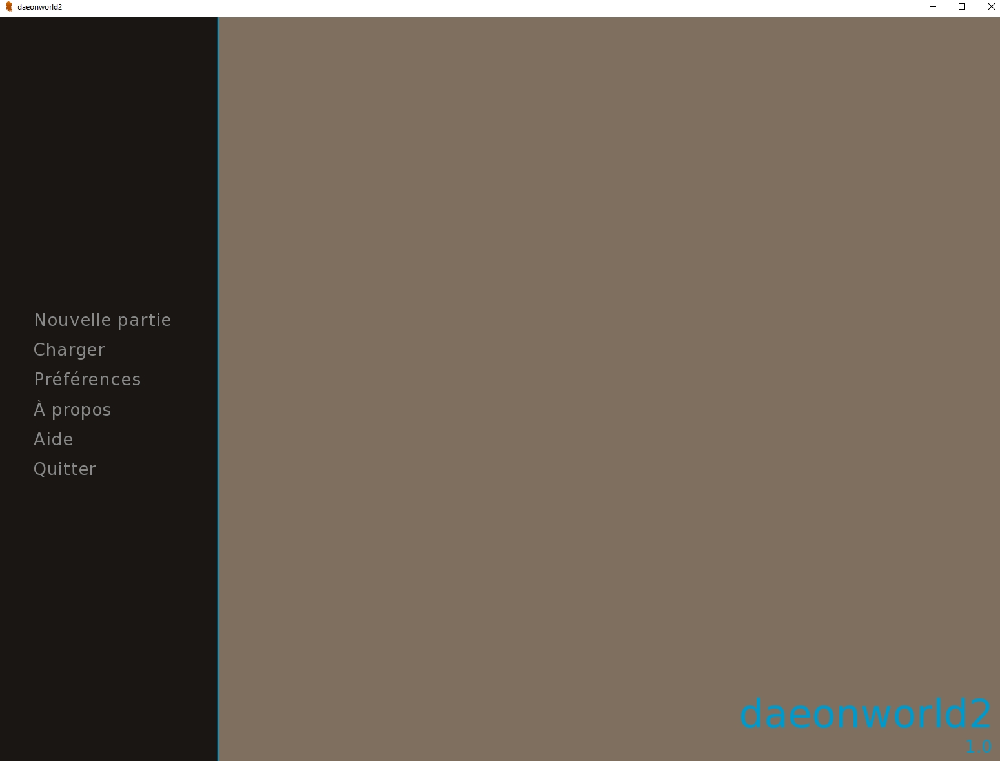
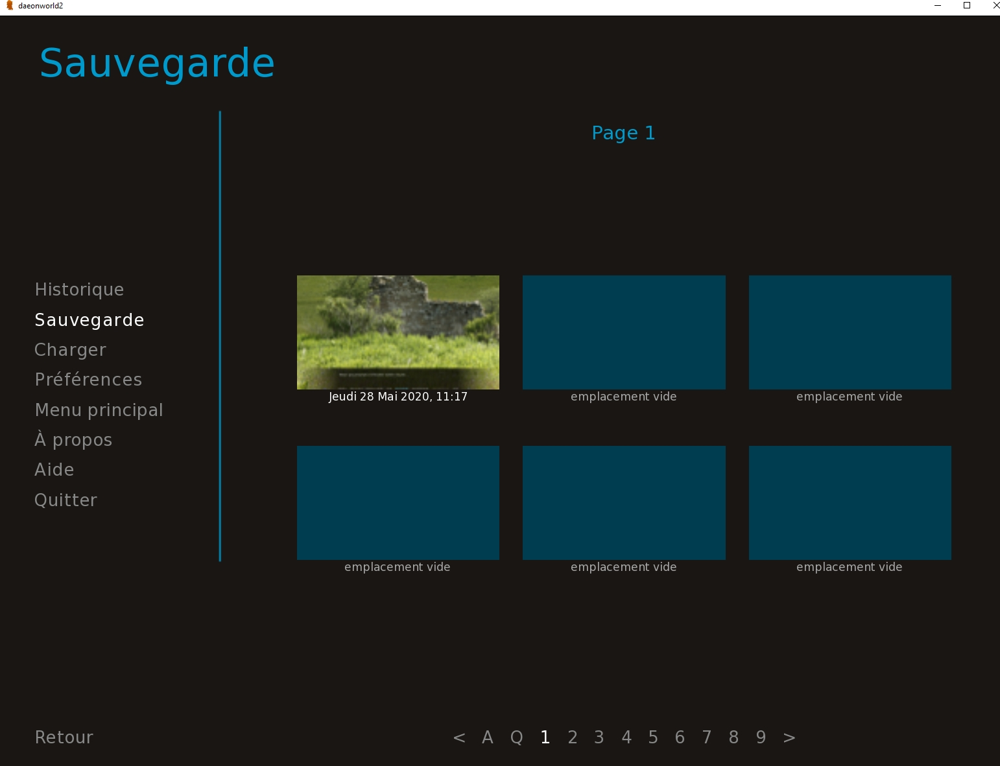
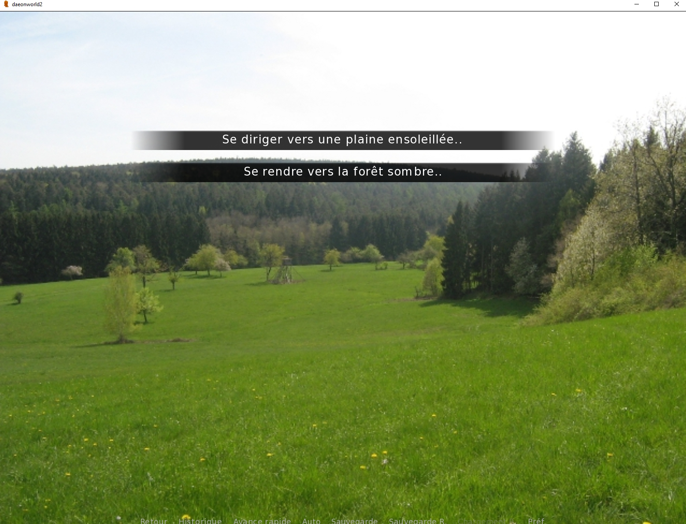
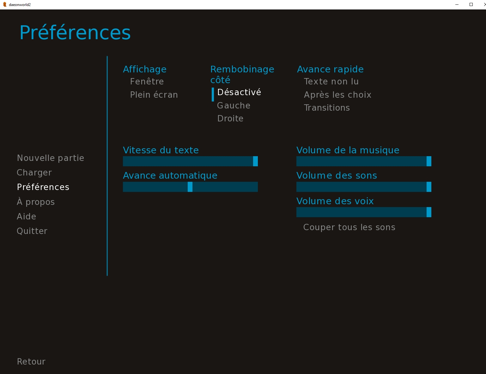
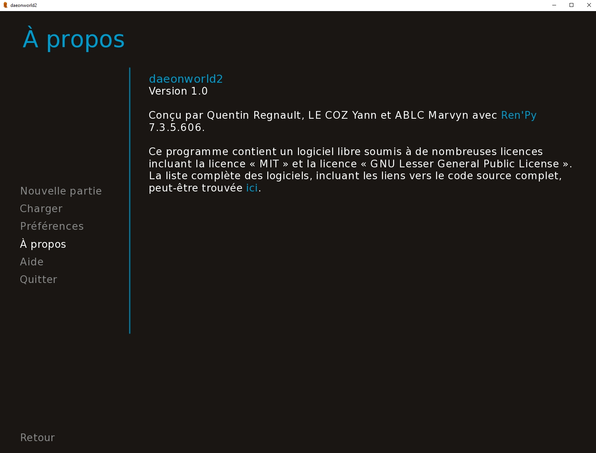

# Manuel d'utilisation

Pour lancer le jeu, connecter vous à votre compte depuis le launcher. Si vous n'avez pas de compte, vous pouvez en créer un comme indiqué dans le readme.
Le jeu se lance automatiquement une fois connecté.

Le principe du jeu est de cliquer avec la souris pour faire défiler le scénario textuel. Vous pouvez avoir une influence sur le déroulement du scénario et emprunter différents chemins avec l'aide des choix qui vous seront proposés.

**Menu du jeu :**

Pour lancer une nouvelle partie, il suffit de cliquer sur "Nouvelle Partie".

**Menu des emplacements des sauvegardes:**

Il suffit de cliquer sur la sauvegarde pour la charger, sinon de cliquer sur une des cases vides pour sauvegarder sa position actuelle.

**Aperçu d'un choix dans le jeu :**

**Menu des options :**

Les options sont assez triviales, celles relatives aux sons ne sont ici pas à prendre en compte, le jeu n'étant pas encore composé d'audios.

**Menud des credits :**

